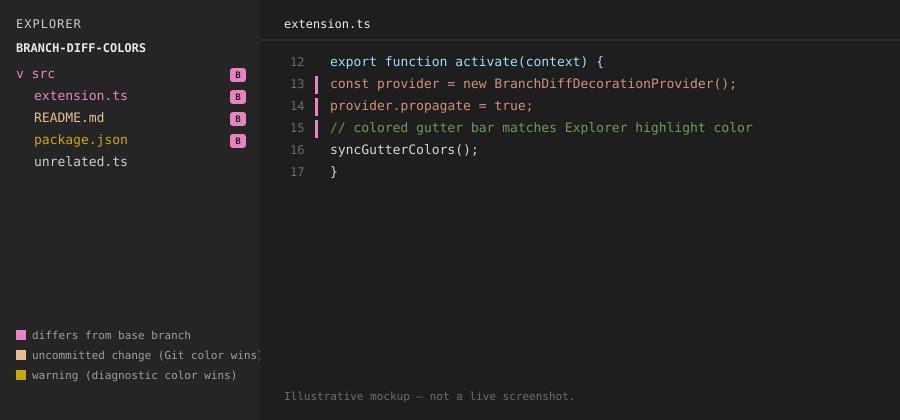

# Branch Diff Colors

[](https://github.com/sigvet/branch-diff-colors/actions/workflows/ci.yml)
[](https://github.com/sigvet/branch-diff-colors/actions/workflows/release.yml)
[](https://github.com/sigvet/branch-diff-colors/releases/latest)
[](LICENSE)
[](https://code.visualstudio.com/)

A VS Code extension that highlights files and folders in the Explorer that
**differ from another branch** — whether or not those differences are
committed — plus matching gutter bars in the editor. VS Code's built-in Git
decorations only cover uncommitted working-tree state; this fills the gap for
comparing against an arbitrary base branch like `main`.

<p align="center">
  
</p>

<sub>Mockup illustrating the behavior described below — not a live screenshot.</sub>

## Why
- **Folders get marked too** — just like Git tints a folder when a file
  inside it has uncommitted changes, a folder containing a file that differs
  from your base branch gets the same treatment.
- **Never fights for attention** — errors/warnings and uncommitted-change
  colors always win. This extension only adds the small `B` badge on top of
  them instead of overriding their color.
- **Gutter bars match the Explorer color** — the quick-diff bars in the
  editor use the exact same highlight color as the Explorer badge, so the
  two visuals read as one signal.

See [`extension/README.md`](extension/README.md) for full usage docs,
settings, and commands.

## Repository layout
```
.
├── extension/     # the actual VS Code extension (source, package.json, README)
├── docs/          # README assets
├── .github/       # CI: build + release workflows
├── LICENSE
└── README.md      # this file
```

The extension is self-contained in [`extension/`](extension) so its own
`package.json`, build output, and marketplace-facing README stay separate
from repo-level concerns like CI and licensing.

## Development
```bash
cd extension
npm install
npm run compile   # or: npm run watch
```

Then open the `extension/` folder in VS Code and press `F5` to launch an
Extension Development Host with the extension active.

## Building a .vsix
```bash
cd extension
npx @vscode/vsce package
```

## Releasing
Push a tag matching `v*` (e.g. `v0.2.0`) and GitHub Actions will compile,
package the `.vsix`, and attach it to a new GitHub Release automatically —
see [`.github/workflows/release.yml`](.github/workflows/release.yml).

```bash
git tag v0.2.0
git push origin v0.2.0
```

## Contributing
Issues and PRs welcome. Keep changes scoped to `extension/` unless you're
touching repo-level tooling (CI, license, docs).

## License
[MIT](LICENSE)
