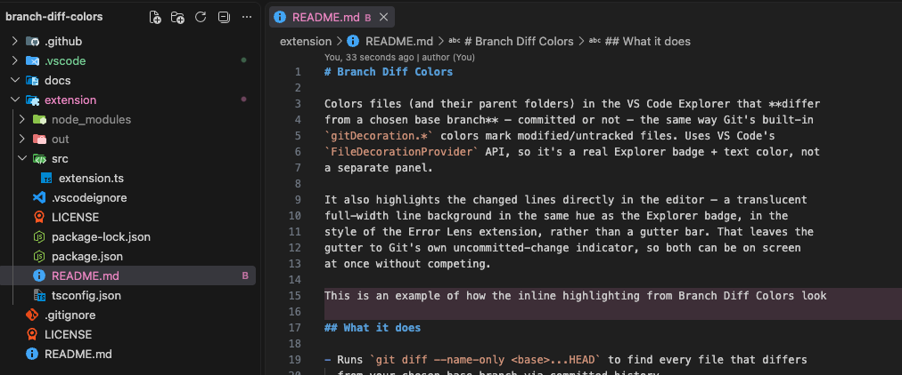

# Branch Diff Colors

[](https://github.com/sigvet/branch-diff-colors/actions/workflows/ci.yml)
[](https://github.com/sigvet/branch-diff-colors/actions/workflows/release.yml)
[](https://github.com/sigvet/branch-diff-colors/releases/latest)
[](LICENSE)
[](https://code.visualstudio.com/)

A VS Code extension that highlights files and folders in the Explorer that
**differ from another branch** — whether or not those differences are
committed — plus matching line highlights in the editor. VS Code's built-in Git
decorations only cover uncommitted working-tree state; this fills the gap for
comparing against an arbitrary base branch like `main`.

<p align="center">
  
</p>

## Get started

1. Install from a packaged `.vsix` — grab the latest one from the
   [Releases page](https://github.com/sigvet/branch-diff-colors/releases/latest),
   then run:
   ```bash
   code --install-extension branch-diff-colors-<version>.vsix
   ```
   (Not yet published to the VS Code Marketplace.)
2. Open a git repository in VS Code.
3. Set the branch to compare against via the Command Palette:
   **Branch Diff Colors: Set Base Branch to Compare Against** (defaults to `main`).
4. Files and folders that differ from that branch now show a `B` badge and
   highlight color in the Explorer, plus matching line highlights in the editor.

See [`extension/README.md`](extension/README.md) for the full command list,
settings, and known limitations.

## Why

- **Folders get marked too** — just like Git tints a folder when a file
  inside it has uncommitted changes, a folder containing a file that differs
  from your base branch gets the same treatment.
- **Never fights for attention** — errors/warnings and uncommitted-change
  colors always win. This extension only adds the small `B` badge on top of
  them instead of overriding their color.
- **Changed lines are highlighted, not gutter-marked** — lines that differ
  from the base branch get a translucent full-width background, the way Error
  Lens tints a line with a diagnostic: a deeper pink on dark themes, a paler
  one on light themes. The gutter stays free for Git's own uncommitted-change
  bars, so the two never overlap or fight over color.
- **You can see what the line used to say** — each changed line prints its
  base-branch version to the right, in the Explorer color, so you can read
  the before and after without opening a diff view.
- **Saving a file isn't a branch change** — by default only committed history
  is compared, so a file you merely saved stays unmarked. Flip
  `branchDiffColors.includeUncommitted` on if you want working-tree edits
  counted too.

## Repository layout

```
.
├── extension/     # the actual VS Code extension (source, package.json, README)
├── docs/          # README assets
├── .github/       # CI: build + release workflows
├── LICENSE
└── README.md      # this file
```

The extension is self-contained in [`extension/`](extension) so its own
`package.json`, build output, and marketplace-facing README stay separate
from repo-level concerns like CI and licensing.

## Development

```bash
cd extension
npm install
npm run compile   # or: npm run watch
```

Then open the `extension/` folder in VS Code and press `F5` to launch an
Extension Development Host with the extension active.

## Building a .vsix

```bash
cd extension
npx @vscode/vsce package
```

## Releasing

Push a tag matching `v*` (e.g. `v0.2.0`) and GitHub Actions will compile,
package the `.vsix`, and attach it to a new GitHub Release automatically —
see [`.github/workflows/release.yml`](.github/workflows/release.yml).

```bash
git tag v0.2.0
git push origin v0.2.0
```

## Contributing

Issues and PRs welcome. Keep changes scoped to `extension/` unless you're
touching repo-level tooling (CI, license, docs).

## License

[MIT](LICENSE)
